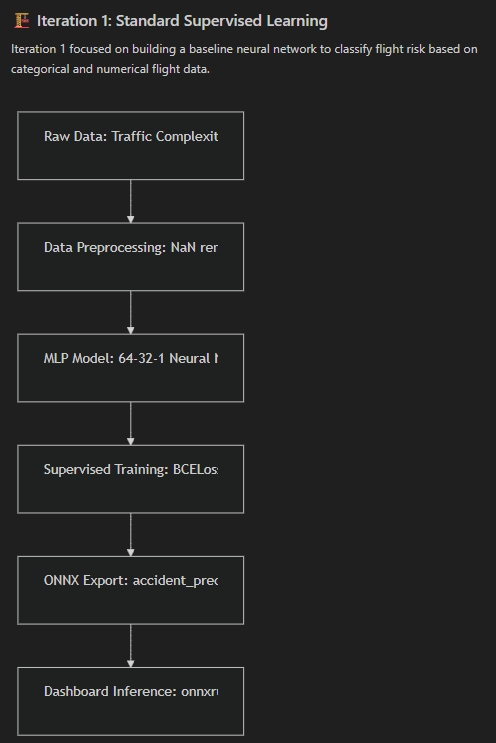
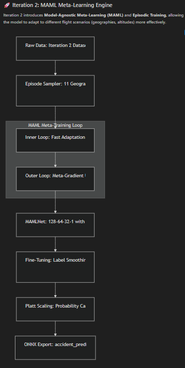
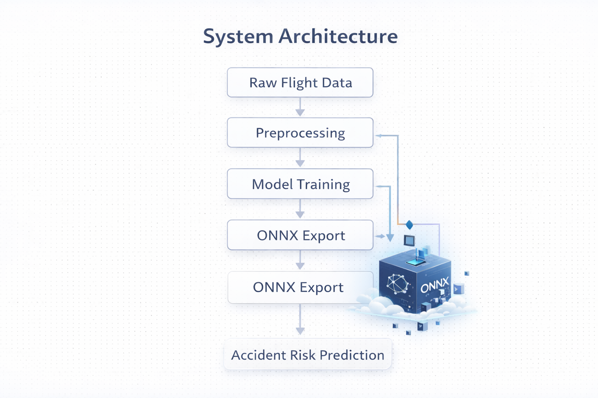
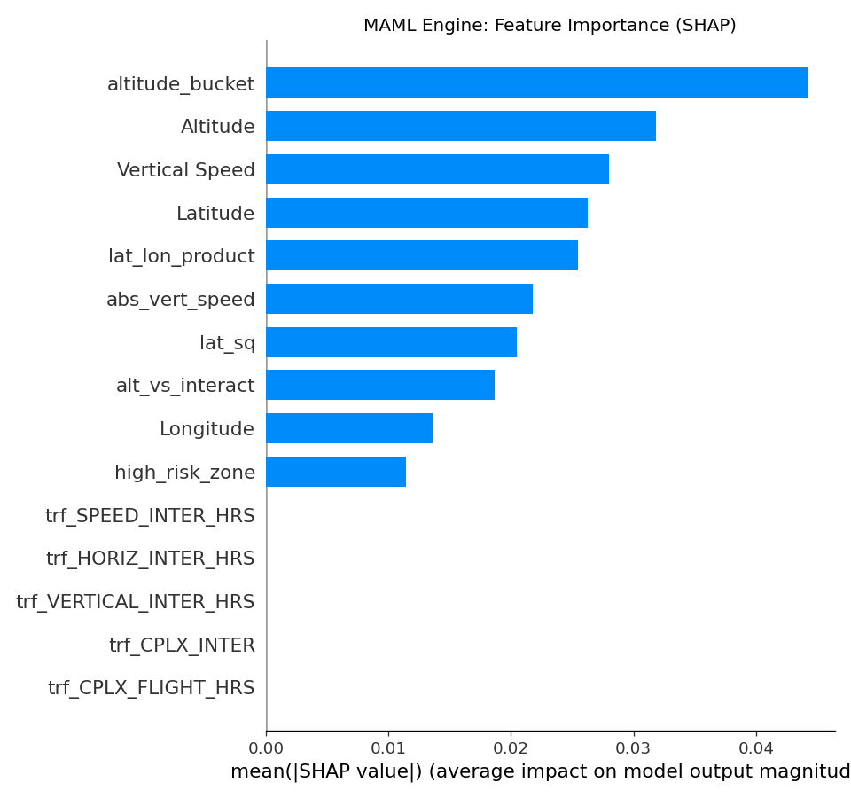
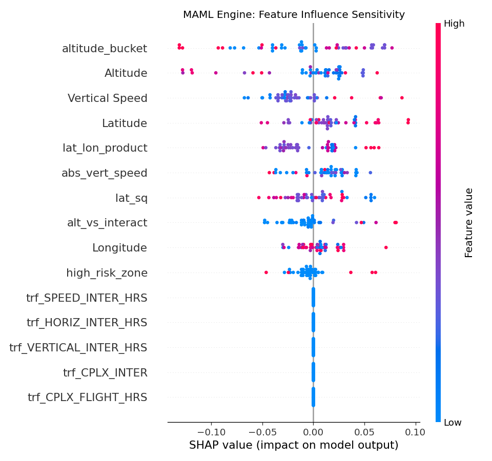
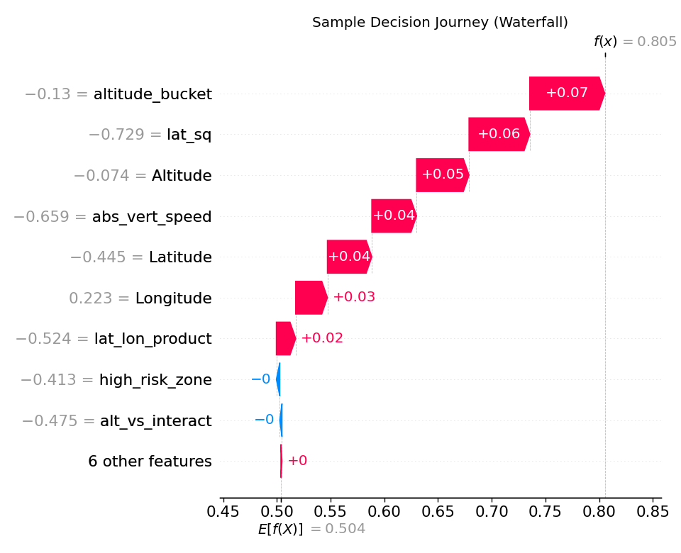

# AirTraffic-Accident-Risk-Model-Meta-Learning
Machine learning model for aviation accident risk prediction using ACAS and air traffic complexity data. Includes ONNX model export for deployment.
<p align="center">
  
  
  
</p>
<p align="center">
  
</p>
<h1 align="center">✈️ ONNX-Based Air Crash Probability Analysis</h1>
<h3 align="center">A Predictive Aviation Safety System using EASA ATC Public Data</h3>

---

## 📌 Abstract

This project presents a machine learning-based aviation safety system designed to estimate air crash probability using Air Traffic Control (ATC) public datasets from EASA.

The system analyzes flight path fluctuations, airspeed variations, and geographic movement patterns to identify high-risk conditions. The trained predictive models are exported using **ONNX (Open Neural Network Exchange)** to enable platform-independent deployment and real-time inference capability.

This work demonstrates an end-to-end pipeline from raw aviation data ingestion to deployment-ready predictive modeling.

---

## 🏷 Badges


> Replace `YOUR_USERNAME` with your GitHub username.

---

## 🎯 Research Objectives

- Analyze aviation flight path fluctuations
- Engineer predictive safety features
- Train accident probability classification models
- Export models to ONNX for cross-platform compatibility
- Identify geographic high-risk zones
- Explore automated “Mayday” alert triggers

---

## 📊 Dataset Description

**Source:** EASA Air Traffic Control Public Data  

Features include:
- Latitude
- Longitude
- Airspeed
- Flight path deviation metrics
- Traffic complexity indicators

The dataset aggregates information from multiple ATC sources.

---

## 🧠 Methodology

### 1️⃣ Data Preprocessing
- Missing value handling
- Feature normalization
- Removal of irrelevant variables
- Merging ACAS + Traffic Complexity datasets

### 2️⃣ Exploratory Data Analysis
- Distribution analysis
- Geographic trend visualization
- Correlation analysis
- Outlier detection

### 3️⃣ Feature Engineering
- Path instability metrics
- Speed fluctuation indicators
- Spatial risk mapping

### 4️⃣ Model Training
- Supervised classification approach
- Train-test split
- Model validation

### 5️⃣ ONNX Conversion
- Export trained model to ONNX
- Enable inference outside Python ecosystem

---

## 📈 Model Evaluation

To assess predictive performance, the following metrics are evaluated:

### 🔹 Accuracy
Overall correctness of the model.

### 🔹 Precision
Measures how many predicted high-risk cases were actually high-risk.

### 🔹 Recall (Sensitivity)
Measures how many actual high-risk cases were correctly identified.

### 🔹 F1-Score
Harmonic mean of Precision and Recall.

### 🔹 ROC-AUC Score
Evaluates the model's ability to distinguish between safe and high-risk flights across different classification thresholds.

---

## 📊 Confusion Matrix

The confusion matrix provides detailed classification breakdown:

|                | Predicted Safe | Predicted Risk |
|----------------|---------------|---------------|
| Actual Safe    | True Negative  | False Positive |
| Actual Risk    | False Negative | True Positive |

- **False Positives:** False alarm situations  
- **False Negatives:** Dangerous undetected cases (critical in aviation safety)

In safety-critical systems, minimizing **False Negatives** is especially important.

---

## 📈 ROC Curve Analysis

The ROC curve plots:

- True Positive Rate (Recall)
- False Positive Rate

A model with strong predictive power will show:
- Curve close to top-left corner
- AUC score close to 1.0

This ensures reliable discrimination between safe and high-risk flight conditions.

---

## 🚀 How to Run

### 1️⃣ Create Virtual Environment
```bash
python -m venv venv
```

### 2️⃣ Activate
Windows:
```bash
venv\Scripts\activate
```

Mac/Linux:
```bash
source venv/bin/activate
```

### 3️⃣ Install Requirements
```bash
pip install -r requirements.txt
```

### 4️⃣ Execute Notebooks
- `ATC.ipynb` → EDA & preprocessing
- `onnx_1.ipynb` → Model training
- `ONNX_2.ipynb` → Advanced risk analysis

---

## 📦 Deployment Capability

The use of **ONNX** enables:

- Cross-language inference (C++, Java, etc.)
- Cloud deployment
- Edge deployment
- Real-time aviation monitoring systems

---

## 🔮 Future Work

- Real-time streaming integration using Apache Kafka
- Distributed processing using Apache Spark Streaming
- Live risk monitoring dashboards
- Automated alert system for aviation authorities
- Integration into ATC decision support systems

---

## 🏗 Project Architecture
<p align="center">                                
      
                                          
  </p>                                            

## 🏗 System Architecture

<p align="center">
  
</p>
```
Raw ATC Data
      ↓
Data Cleaning
      ↓
EDA & Feature Engineering
      ↓
ML Classification Model
      ↓
ONNX Conversion
      ↓
Risk Prediction & Alert Simulation
```

---

# Explainable ATC MAML Engine (SHAP)

This package contains **Iteration 2** of the Air Traffic Control (ATC) Risk Prediction model, featuring **MAML (Model-Agnostic Meta-Learning)** and **SHAP (SHapley Additive exPlanations)** for decision transparency.

## 🌟 Key Features
- **MAML Meta-Learning**: A model designed for rapid adaptation to new aviation sectors and traffic conditions.
- **SHAP Explainability**: Deep insights into why the model classifies a flight as "High Risk".
- **ONNX Weights**: Pre-trained model in an interoperable format for high-performance inference.

## 📂 Package Contents
- `train_v2.py`: The core MAML training architecture.
- `calculate_shap_v2.py`: The explainability engine that generates feature importance and sensitivity plots.
- `accident_prediction_v2.onnx`: Optimized pre-trained model weights.
- `X_test_v2.npy`: Representative sample data for SHAP analysis.
- `model_metrics.json`: Model performance metadata and feature labels.
- `assets/`: Folder containing generated SHAP bar and summary plots.
- `requirements.txt`: Python dependencies.

## 🚀 Getting Started

### 1. Install Dependencies
```bash
pip install -r requirements.txt
```

### 2. Run SHAP Explainability Analysis
To re-generate the SHAP values and visualizations:
```bash
python calculate_shap_v2.py
```
This will update the plots in the `assets/` folder.

## 📊 Understanding the results
<p align="center">                                
                                          
  </p> 
### Global Importance (`v2_shap_bar.png`)
Shows the overall ranking of features. For example, if **Altitude** is at the top, it means the model's risk prediction is most sensitive to flight height.

### Feature Sensitivity (`v2_shap_summary.png`)
<p align="center">                                
                                          
  </p> 
Shows the *direction* of influence.
- **Red dots** (High value) on the right mean the feature increases risk.
- **Blue dots** (Low value) on the right mean the feature increases risk.

### Decision Journey (`v2_shap_waterfall.png`)
<p align="center">                                
                                          
  </p> 
Shows the contribution of each feature to a **single specific prediction**.
- **Positive values (Pink)**: Features that pushed the risk higher for this flight.
- **Negative values (Blue)**: Features that decreased the risk for this flight.
- **E[f(x)]**: The base risk level.
- **f(x)**: The final predicted risk probability.

---
*Developed for the ADAI Project - Air Traffic Control Risk Classification CC ABHISHEK HIRVE.*

## 📁 Project Structure

```
ADAI_Proj/
│
├── ATC.ipynb
├── onnx_1.ipynb
├── ONNX_2.ipynb
├── data/
├── models/
├── requirements.txt
└── README.md

Iteration_2_MAML_Engine/
├── data/                            # Processed datasets for meta-learning
│   ├── final_acas_data.csv
│   ├── final_dataframe_trfcomplexity.csv
│   └── ... (auxiliary ONNX data)
├── .gitignore                       # Keeps repo clean from cache/temp files
├── .ipynb_checkpoints/
├── ONNX_2.ipynb                     # Main Analysis & Workflow Notebook
├── README.md                        # Technical Guide for Iteration 2
├── accident_prediction_v2.onnx      # Final Trained MAML Model
├── build_dashboard_data_v2.py       # Dashboard Metric Generator
├── calculate_metrics.py             # Precision/Recall/F1 Calculator
├── extract_geo.py                   # Geo-spatial Feature Extractor
├── generate_dashboard_data.py       # Main Dashboard Plotting Engine
├── inject_geo_data.py               # Landing Page Data Integration
├── model_metrics.json               # Performance Benchmarks
├── requirements.txt                 # Dependencies (torch, onnx, etc.)
├── set_complexity.py                # Complexity Configuration Utility
└── train_v2.py                      # Core MAML Meta-Learning Engine
```

---

## 🧪 Research Contribution

This project demonstrates:

- Applied AI in safety-critical systems
- End-to-end ML engineering pipeline
- Aviation risk modeling
- Model portability and deployment design
- Practical ONNX implementation

---

## 👤 Author

Abhishek Hirve
Artificial Intelligence & Machine Learning  
Focused on aviation safety and applied AI systems.

---

## 📜 License

This project is intended for educational and research purposes.

